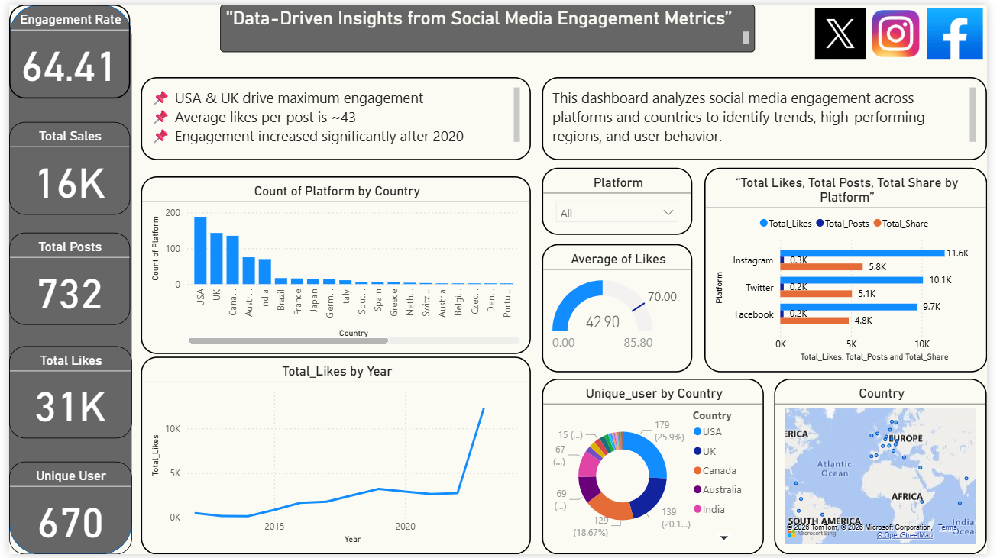

# social-media-engagement-dashboard

## 📌 Project Overview
This project analyzes social media engagement data and presents insights through an interactive Power BI dashboard.  
The data was cleaned and prepared using Python (Pandas).

## 🛠 Tools & Technologies
- Python (Pandas)
- Power BI
- Excel
- GitHub

## 🔄 Data Cleaning Steps
- Removed duplicate and null values
- Renamed columns for clarity
- Split timestamp into date and time
- Exported cleaned data for Power BI visualization

## 📊 Dashboard Preview

## 📁 Project Structure
- `data/` → Cleaned dataset  
- `python/` → Data cleaning notebook  
- `images/` → Dashboard screenshots  

## ✅ Key Insights
- Identified high-engagement posts
- Compared engagement across platforms
- Tracked trends over time

